# Multi-Layered SOC Lab: Threat Detection & Automated Malware Remediation

**By:** Olakunle Odesanya  
Entry-Level Cybersecurity Analyst  
May 2026  

Tech Stack: Wazuh (SIEM), Suricata (IDS), VirusTotal API, Ubuntu (Endpoint), Kali Linux (Manager), Diamorphine

## 1. Executive Summary
This project demonstrates the deployment of a functional Security Operations Center (SOC) designed to detect host-based, network-based, identity-based and file-based threats. By integrating Wazuh, Suricata, and VirusTotal, I created a unified visibility pipeline that identifies kernel-level obfuscation (rootkits), malicious network patterns, unauthorized access attempts, and automated malware remediation within a virtualized lab environment.

## 2. Infrastructure Architecture
The lab environment was built using a private virtual network to simulate an enterprise internal LAN.  
•	Wazuh Manager: Kali Linux (Centralized Intelligence).  
•	Managed Endpoint: Agent Name: SOC_Lab_Endpoint (Ubuntu 22.04 LTS)   
•	Connectivity: The SOC_Lab_Endpoint agent communicates with the Manager over a dedicated virtual bridge. Connectivity was verified via the Wazuh Dashboard, showing the agent status as "Active."  

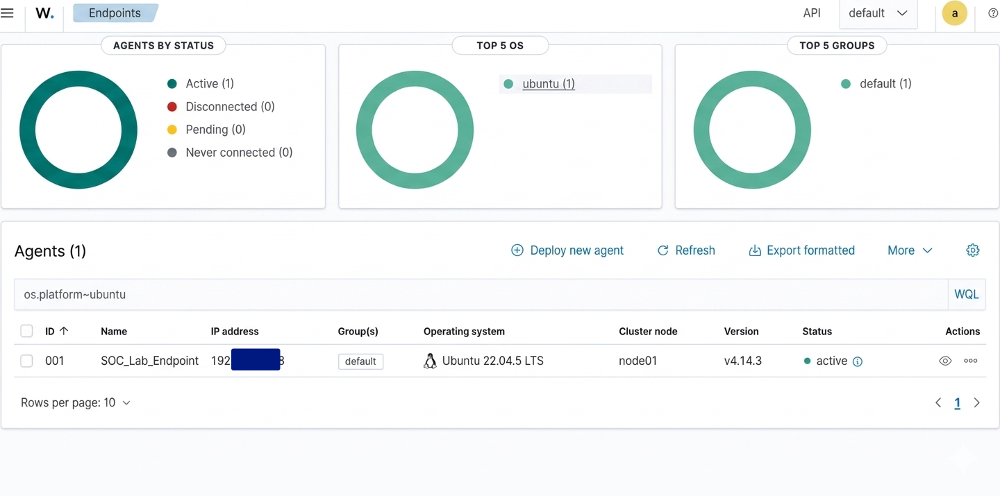

## 3. Identity & Access Monitoring: Syslog Analysis
I established baseline visibility for system access.  
•	Implementation: Configured the SOC_Lab_Endpoint agent to monitor /var/log/auth.log and ingest syslog data.  
•	Attack Simulation: Performed multiple failed login attempts on the SOC_Lab_Endpoint agent.  
•	Detection Result: The Wazuh Dashboard successfully generated "User authentication failure" alerts Rule level 3 and Rule.id 2501. This provided real-time visibility into potential brute-force attacks.  

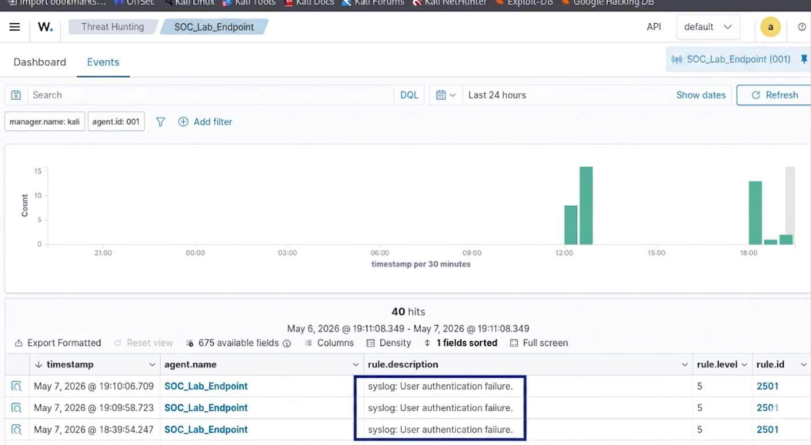

## 4. Host-Based Security: Rootkit Emulation & Detection
The objective was to test the SIEM's ability to see "invisible" threats using the Diamorphine rootkit.  
•	Attack Phase: Executed a stealth attack to hide the rsyslogd process. Got a PID using ps aux | head and run the kill signal Using kill -31 PID, the process remained active in memory but became invisible to ps aux  
•	Defense Phase: Hardened the SOC_Lab_Endpoint agent by changing the rootcheck frequency to 30 seconds for rapid integrity audits.  
•	Detection Result: Wazuh Manager identified the discrepancy between the kernel's process table and system calls, triggering a Level 11 High Severity Alert (Rule 521) for a hidden process.  

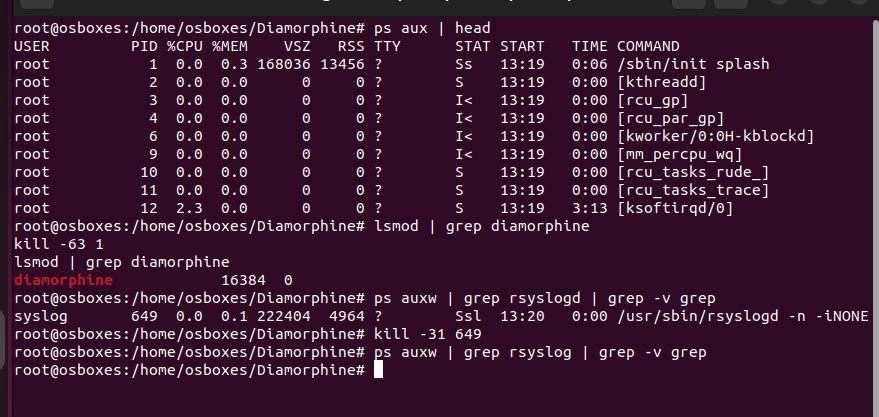

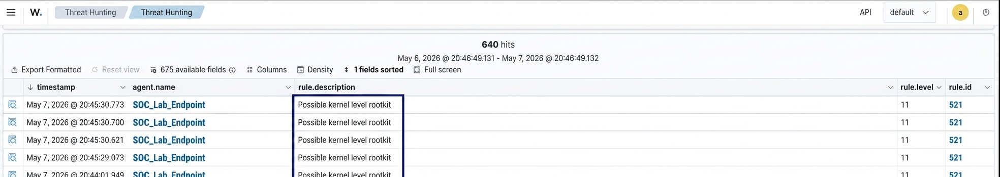

## 5. Network Security: Suricata IDS Integration
•	Implementation: Installed Suricata with the Emerging Threats (ET) Open rule set.  
•	The Pipeline: Integrated Suricata’s eve.json output into the SOC_Lab_Endpoint Agent’s ingestion engine, merging network telemetry with host logs.  
•	Validation: Generated ICMP traffic via the Kali Kinux terminal. The IDS successfully flagged the reconnaissance attempt, providing a unified view on the Wazuh Dashboard.  

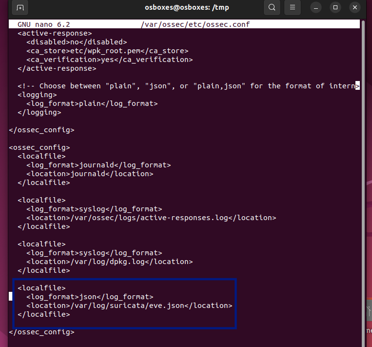

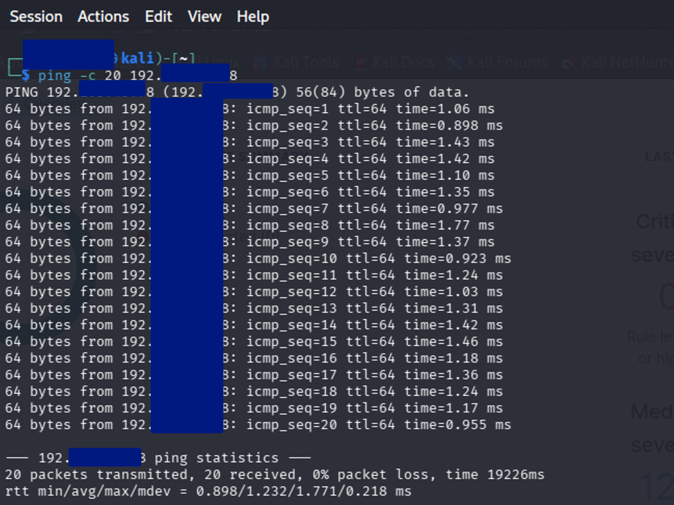

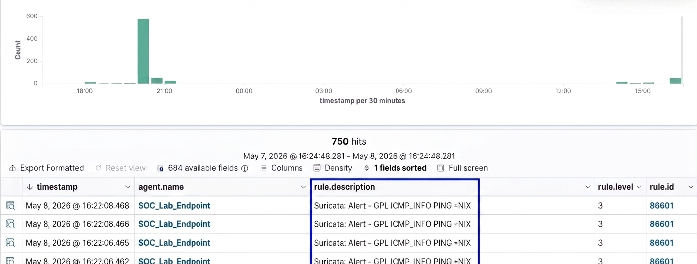

## 6. Automated Response: VirusTotal & Malware Remediation 
Implemented an Active Response loop to handle malicious files automatically.  
•	File Integrity Monitoring (FIM): Configured SOC_Lab_Endpoint agent to monitor the /root directory for new files.  
•	API Integration: Connected Wazuh Manager to the VirusTotal API to analyze file hashes detected on the SOC_Lab_Endpoint agent via FIM.  
•	Threat Trigger: Created a custom rule (87105) that fires only when VirusTotal returns a positive malware result.  
•	Validation: I downloaded the EICAR test file to the SOC_Lab_Endpoint /root directory. Within seconds, the file was identified, verified as malicious, and autonomously deleted.  

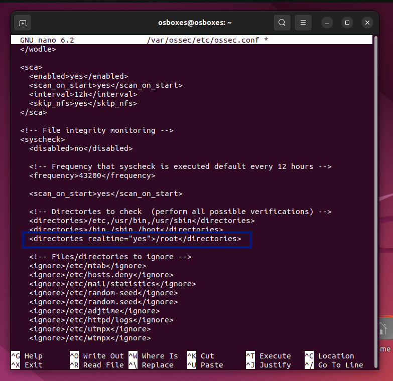

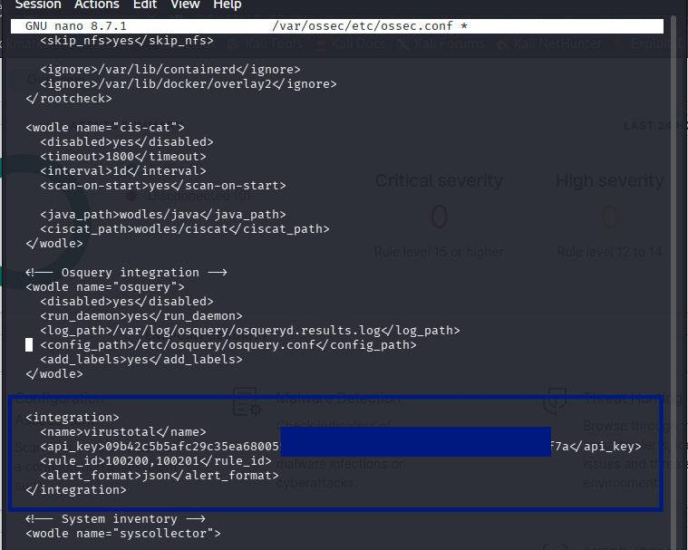

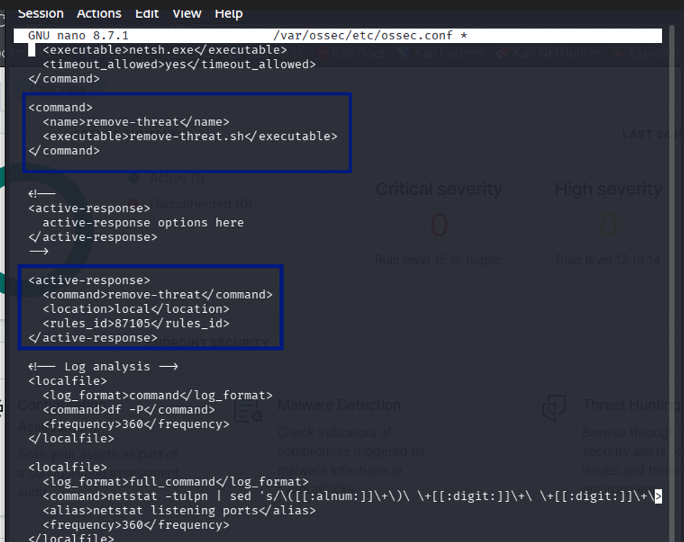

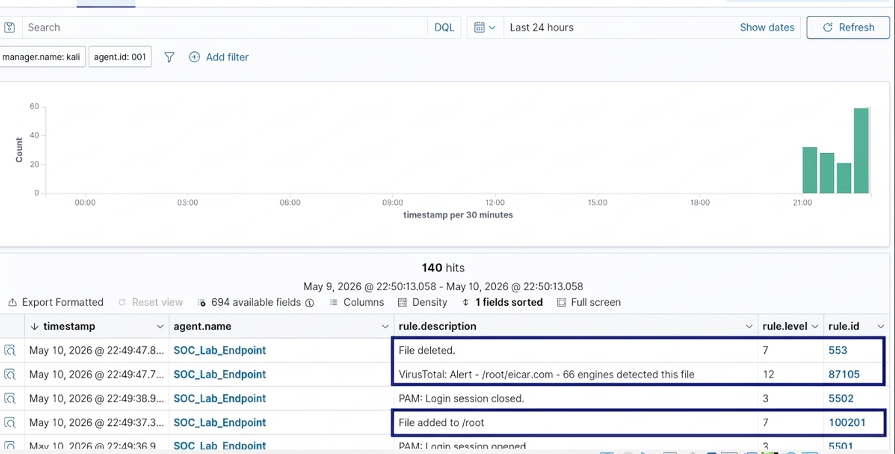

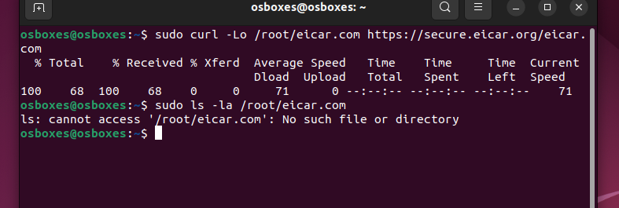

## 7. Conclusion
This lab validates a defense-in-depth strategy. While the rootkit (Diamorphine) successfully fooled local OS utilities and network probes (ICMP) tested the perimeter, the SOC's ability to cross-reference kernel data, inspect network packets, and autonomously remediate malware through API integrations ensures that even sophisticated attacks are identified and neutralized.
